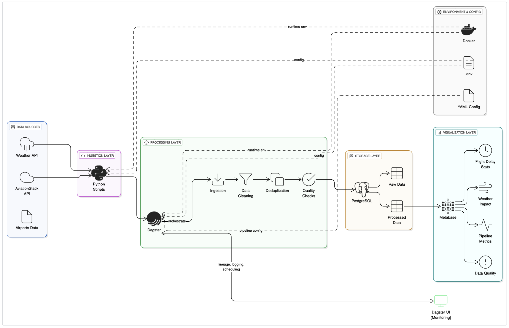

# Architecture and Design

The pipeline is designed following the Medallion architecture pattern:

- **Raw Layer**: Stores ingested raw data unchanged, serving as the single source of truth.
- **Silver Layer**: Contains cleaned, validated, and enriched data with business rules applied.
- **Gold Layer**: Provides aggregated metrics and KPIs ready for consumption by dashboards and analytics tools.

Dagster assets correspond to each step, enabling modularity and lineage tracking.

## Orchestration

The pipeline orchestration is implemented using **Dagster**, which provides:

- **Declarative asset-based orchestration** enabling clear separation between transformation logic and execution.
- **Jobs** that group related assets into executable pipelines (e.g., daily incremental load jobs).
- **Partial rerun** capabilities, allowing selective execution of assets when only a subset of data needs refreshing.
- **Backfill support** to reprocess historical data partitions when required (future implementation).
- **Scheduling and partitioning**, enabling incremental data processing using time partitions (future implementation).
- Integrated **data quality checks** embedded into asset computations to ensure pipeline reliability.

This modular orchestration design simplifies monitoring, debugging, and scaling.

## Containerization and Deployment

The system is containerized using **Docker** with:

- Separate images for Dagster core and user code.
- `docker-compose.yml` for local development and testing.

The system is containerized using Docker and deployed with docker compose

## High-level architecture

